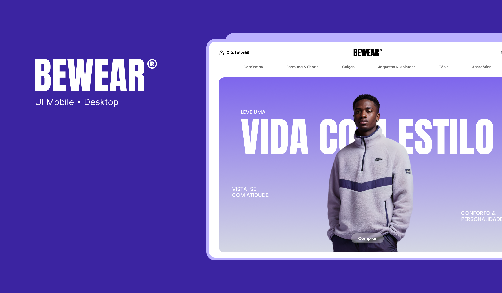

## Bewear

### Autenticação via Google
- Va te cloud console
- Crie um novo projeto
- Vá em "APIs e Serviços" > "Credenciais"
- Clique em "Criar Credenciais" > "ID do Cliente OAuth"
- Clique no submenu "Tela de consentimento OAuth"
- Adicione no formulário nome, email
- Em Audiências: external
- Apos isso na proxima tela selecione "Criar cliente OAuth"
- Selecione "Aplicativo da Web"
- Dê um nome para o cliente
- Autorize os origens JavaScript: `http://localhost:3000`
- Adicione os URIs de redirecionamento autorizados: `http://localhost:3000/api/auth/callback/google`
- Copie o ID do cliente e o segredo do cliente para os próximos passos